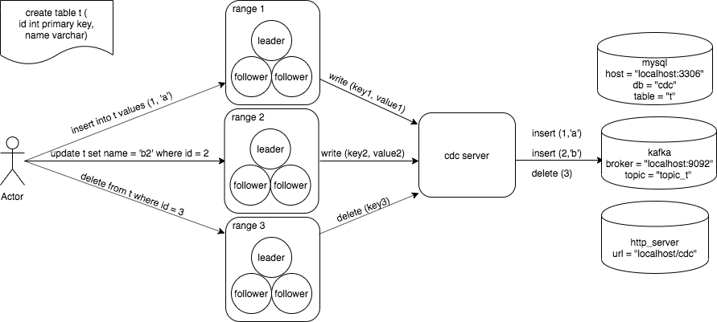

# CDC设计

##	1 整体思路

Change Data Capture，即把关于某个 table 的每次修改实时更新同步到外部的系统。<br />
典型应用如备份、异地机房数据同步、数据同步到搜索引擎等。

整体实现上由cdc-server负责把所订阅表的所有range内修改变更推送到外部的订阅者。<br />
推送数据的基本单位为行级别，即该行修改或删除后的最新的列值组合。

当前方案的主要考量：<br />
* 独立进程，不依赖第三方系统，减少和系统其他组件的耦合和对系统核心功能的影响。<br />
* 无状态，可以根据订阅压力扩展cdc-server数量，减少运维成本。

<br />


 
## 2 订阅流程

cdc订阅的对象目前为一个 table。

### 2.1	向任意cdc-server发起订阅请求

cdc-server将订阅信息写入meta数据库。

* meta数据库表结构定义：
```
1) subscribe：记录订阅信息
CREATE TABLE subscribe (
	cluster_id int,
	db_name varchar(255),
	table_name varchar(255),
	subscribe_name varchar(255),
	db_id int,
	table_id int,
	master_addrs varchar(255),
	sink varchar(255),
	cancel int,
	owner varchar(255),
	PRIMARY KEY (cluster_id, db_name, table_name, subscribe_name)
);

2）progress：记录range pull进度信息
CREATE TABLE progress (
	db_name varchar(255),
	table_name varchar(255),
	subscribe_name varchar(255),
	range_id int,
	progress_stage int,
	progress_init_snapshot_version int,
	progress_current_snapshot_version int,
	progress_last_snapshot_key varchar(255),
	progress_last_log_index int,
	PRIMARY KEY (db_name, table_name, subscribe_name, range_id)
);

```

* 核心接口示例：

```
1) cdc-server对外提供的订阅接口:
message CDCSink {
    // 外部系统类型，如 mysql, kafka
    string type = 1;  
    // 目标的配置，如 
    // mysql_host="127.0.0.1", mysql_user="cdc_user", mysql_password = "cdc_passwd"
    // mysql_db = "cdc_db", mysql_table = "cdc_table"等
    map<string, string> config = 2;  
}

message SubscribeCDCRequest {
    RequestHeader header = 1;
    string db_name = 2;
    string table_name = 3;          // 订阅源的db_id和table id
    string subscriber_name = 4;     // 订阅者唯一名字，防止同一用途重复订阅
    basepb.CDCSink sink = 5;        // subscribe target db & table
}

message SubscribeCDCResponse {
    basepb.CDCSubscriber subscriber = 1;
}

```

### 2.2 订阅任务认领<br>
订阅任务会被指定的cdc-server定时从meta数据库领取。<br>
收到订阅任务的cdc-server会请求master-server查询订阅对象（table）的所有数据分片（data range）路由信息，<br>
向每个data range的leader发起订阅请求。cdc-server根据订阅任务状态从ds拉取数据<br>
* 核心接口示例：

```
message CdcRegisterRequest {
    uint64 range_id = 1;
    basepb.RangeEpoch range_epoch = 2; // current epoch for verification
    string subscriber_name = 3;
}

message CdcRegisterResponse {
	uint64 init_snapshot_version = 1;
}

message CdcChangeData {
	enum ChangeType {
		WRITE = 0;
		DELETE = 1;
	}

	ChangeType type = 1;
	bytes key = 2;
	bytes value = 3;
}

message CdcPullSnapshotRequest {
	uint64 range_id = 1;
	basepb.RangeEpoch range_epoch = 2;
	string subscriber_name = 3;

	uint64 current_snapshot_version = 4;
	string last_key 		= 5;
}

message CdcPullSnapshotResponse {
	CDCError error = 1;
	uint64 current_snapshot_version = 2;
	repeated CdcChangeData snapshot_data = 3;
	bool end = 4;
}

message CdcPullLogRequest {
	uint64 range_id = 1;
	basepb.RangeEpoch range_epoch = 2;
	string subscriber_name = 3;

	uint64 last_log_index = 4;
}

message CdcPullLogResponse {
	CDCError error = 1;
	repeated CdcChangeData log_data = 2;
	uint64 current_log_index = 3;
}
```

### 2.3	Dataserver处理逻辑

range leader收到注册请求后，返回数据的快照版本作为之后拉取日志的起始index.<br />

收到拉取快照请求后，向cdc-server返回迭代快照数据。<br>

收到拉取日志请求后，向cdc-server返回读raft对应index日志。<br>

## 3 异常处理

### 3.1 dataserver range快照迭代器失效
如果期间有range变化导致快照迭代器不存在或不可用（比如leader切换会导致新的leader上没有快照迭代器存在），那么重新生成新版本的快照，重新迭代数据返回给cdc-server。<br>
cdc-server继续拉取快照数据以新快照版本为准

### 3.2	cdc-server处理新分裂的range
新分裂出的分片继承旧分片的所有订阅进度。cdc-server更新拓扑变更后，会发现没有puller的range，此时如果meta数据库没有此range的进度，那么作为新range对待。<br>
如果新range有parent puller进度，那么集成parent进度

## 4 当前实现限制

* 变更历史只在range维度上有序地推送（用户看来是行级别），不支持事务级别<br/>
如一个写事务涉及三行 a，b，c，则不保证三行在同一时间点或者使用同一个消息一起被推送。
* 同一个行可能存在重复推送 ，at-least-once语义
* no before value，只有每行修改后的
* 当前事务方案如果某行上的intent没有访问，可能intent一直得不到commit，导致这行无法推送（事务方案优化后修复）

## 5 功能点拆分

### 5.1 cdc-server
* cdc metadata管理
* 订阅任务领取和取消逻辑
* 订阅表的range路由变更
* sink pusher实现<br/>
包含kv数据解析、数据交换格式定义及写入mysql、kafka、http+json等外部系统）<br/>
NOTE：外部系统故障不能影响系统本身

### 5.2 dataserver
* 响应订阅和拉取订阅数据的接口<br/>

## 6 未来规划
* cdc filter
* support more sink（es、cfs、jmq等）
* cdc stream 的pause和resume
* alter cdc即支持修改subscriber的配置、重置push进度等
* 支持用SQL语句操作cdc
* tranaction-level feed
* meta数据库是中心，且需要副本备份

## 7 参考资料与对比
[yugabyte change data capture (CDC) architecture](https://docs.yugabyte.com/latest/architecture/cdc-architecture/)

[cockroach change data capture](https://github.com/cockroachdb/cockroach/blob/master/docs/RFCS/20180501_change_data_capture.md)

vs cockroachdb：<br/>
1）no table-level or transaction-level atomic feed<br/>
2）use range specified wal instead of change feed buffer in memory 
