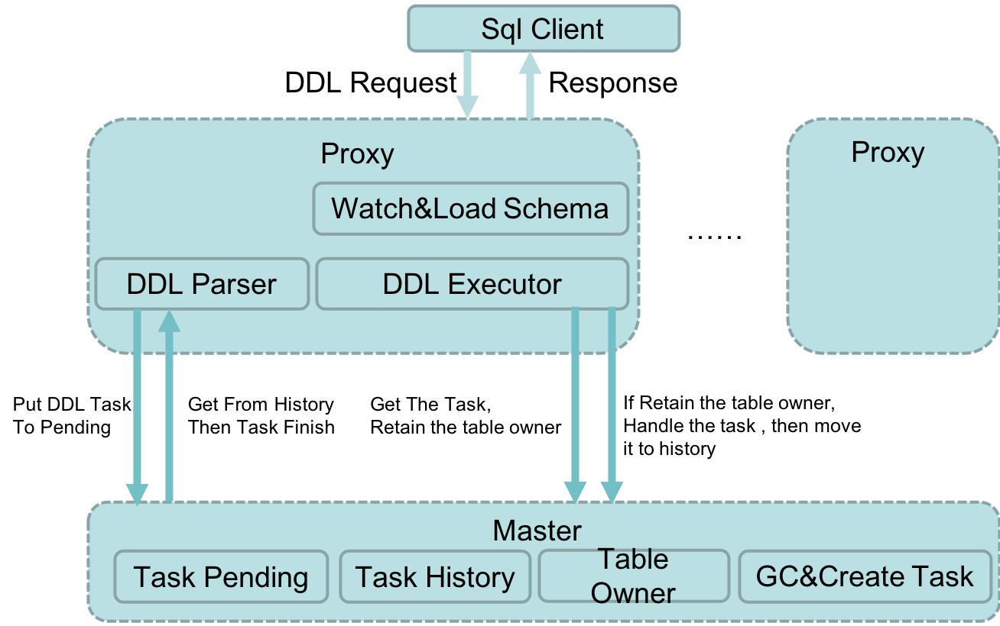

# 在线schema变更设计

参考spanner schema算法：利用多个递进状态执行，只要保证任意相邻两个状态是相互兼容的，整个过程就是可依赖的。只有table owner节点执行对应table DDL 

#State enum
-----------------
  * Create：>absent --> delete only --> write only -->write reorg--> public
  * Delete：>public -> write only -> delete only -> delete reorg(异步) -> absent

## 各状态语义
  * delete-only : 只对删除操作可见。
    + 如果 schema 元素是 table 或 column ，只对 delete 语句生效；
    + 如果 schema 元素是 index ，则只对 delete 和 update 语句生效，其中 update 语句修改 index 的过程是先 delete 后 insert ，在 delete-only 状态时只处理其中的 delete 而忽略掉 insert 。
  * write-only：对写操作可见，对读操作不可见。
    + 例如当某索引处于 write-only 状态时，不论是 insert 、 delete ，或是 update ，都保证正确的更新索引，只是对于查询来说该索引仍是不存在的。
  * public：对所有操作可见
  * reorg ：不是一种 schema 状态，而是发生在 write-only 状态之后的一系列操作。这些操作是为了保证在索引变为 public 之前所有旧数据的索引都被正确地生成。

#Sync
-----------------
   * 保证同一时刻所有proxy之间的 schema 最多有两个不同的版本
   * 利用Lease&Watch机制(etcd)

##Register
  * 系统初始化，在etcd创建Schema version路径，里面存放最新的 schema version 
  * Proxy启动时执行register 操作：
       + 自身生成唯一的 ID，
       + load schema
       + 将自身注册到Proxy register
       + Watch Schema version 路径，获取Schema变更的通知
  * 2*lease TTL

## Lease
  * 租约到期proxy自动load schema ，如果加载失败，则此proxy自动退出，并删除etcd上的register信息
  * 更新Proxy register version

## Watch
  * Watch Schema version 路径，获取变更通知load schema
  * 更新Proxy register version

## Sync
  * 变更完state，将最新的 schema version 更新到 etcd
  * 通过 Proxy register列表查看所有proxy schema version 
  * 如果全部都更新到最新version，则直接进入下一个流程。否则，等待一段时间再查看
  * 最坏情况，等待2*lease 
    

# Owner
-----------------
  * 只有Owner允许执行ddl操作
  * 所有的proxy竞选Owner

## Create Task Owner
  * 针对Create Task竞选Owner，如果是Owner顺序执行Create Task
  * 执行前判断History Queue中是否存在此Task，如果存在则忽略并删除此Create Task
  * 执行完成将Task移入History Queue

## Table Task Owner
  * 获取Table Task列表：
      + 收到Client  DDL Request时，主动触发列表的获取
      + 定时拉取
  * 顺序获取Task，并竞选Table Owner ，如果是Owner执行此Task；否则处理下一个Task
  * 执行前判断History Queue中是否存在此Task，如果存在则忽略并删除此Create Task
  * 执行完成将Task移入History Queue，并释放此Table Owner

#Create Table流程
-----------------

## Proxy
  * 接受Request节点：
      + 逻辑计划：解析生成 DDL Plan 
      + 执行：约束检查，比如 table 名，列定义等； 获取 table ID，生成 table元数据；之后封装成一个 Task， 获取Task ID 放到create task queue 。
      + 响应：检查history queue，如果存在此task，则响应客户端
  * create task owner：
      + 检查table是否存在
      + 将table元数据存到 etcd，
      + 更新 task 的状态为running
      + 调用Master Create Table Instance接口，分配资源
      + 获取Master Response后，更新task的状态，更新table的状态
      + 添加task到history queue
      + 删除task queue

## Master
  * 根据Table Engine type创建ds shard

## 读写操作
  * 需要检查table meta的状态

# Add Index流程
-----------------

## Proxy
  * 接受Request节点：
      + 逻辑计划：解析生成 DDL Plan 
      + 执行：约束检查，比如 table 是否存在，索引名、索引列定义等； 获取 index ID，生成 index元数据；之后封装成一个 Task， 获取Task ID 放到table task queue 。
      + 响应：检查task状态，如果为write only 状态，则响应客户端
  * table owner：
      + 检查索引是否存在
      + 更新table元数据
      + 调用Master Create Index Instance接口，分配资源
      + 更新 task 的状态和index状态
      + 回填旧数据的index data
      + 添加task到history queue
      + 删除task queue

## Master
  * 根据Index Engine type创建ds shard

## 读写操作
  * 需要检查index meta的状态

#QA
-----------------

## In Transaction数据
  * 通过读写锁解决，
  * Transaction启动时获取读锁，结束时释放读锁
  * Schema update时获取写锁，结束时释放写锁

## 并发写
  * reorg时同时update row data，在同一个事务中提交，如果有version冲突，说明row data已经变更，无需reorg
  * 正常事务写，如果有version冲突，则执行事务重试
