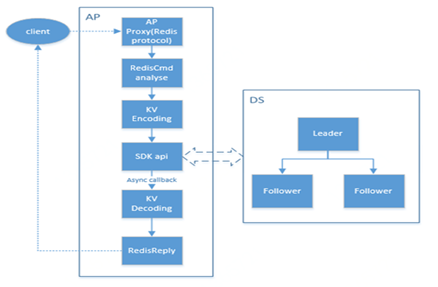

# 整体架构
  ap设计为兼容redis协议的tcp服务端，负责接收原生redis客户端命令，然后调用JIMDB sdk与data server进行交互，写入或读取数据，并将data server返回的数据转换为redis协议，返回给客户端，完成redis命令的处理，整体处理流程如下：

  

  利用redis的auth命令在建立链接时，将JIMDB的相关信息（cluster_id, db_id, table_id)进行包装，完成JIMDB sdk的初始化，然后进行读写操作，各类命令尽量兼容redis语义

## 支持类型
  当前仅支持string和hash两类数据结构，能够进行如下命令处理：
+ **set key value**
+ **get key**
+ **del key**
+ **mset key1 value1 key2 value2 ....**
+ **mget key1 key2 ...**
+ **hset hash field value**
+ **hget hash field**
+ **hmset hash field1 value1 field2 value2 ...***
+ **hmget hash field1 field2 ...**
+ **hdel hash field1 field2 ...**
+ **hgetall hash**

## 编解码方案

### string KEY：
     第1个字节type区分不同的数据类型；（见：数据类型约定）
     第2~3字节是key的hash值；hash存在主要意义是分散key，尽量避免分片过热；
     最后是原始key内容。

### string VALUE：
     第1字节flag用于标记key的删除（0 正常  1 删除）；（非string类型key的删除过程比较冗长，删除前先打标）
     第2~5字节TTL保存key的超时信息，0标识未设置过期时间，大于0即设置了过期时间，单位：ms
     最后是原始Value内容。

### hash类型处理方案
  hash在ap层会被拆分为多个key，原始的key和field被组合成一个key存入data server
