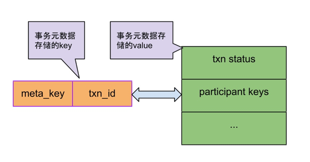
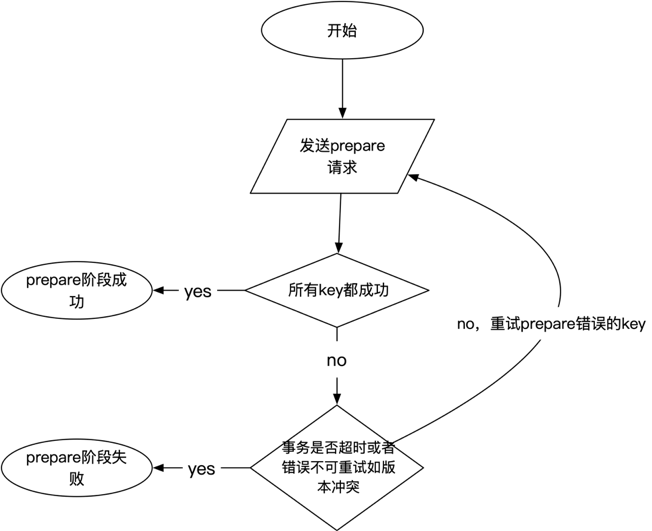
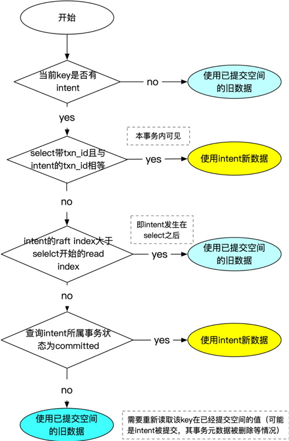
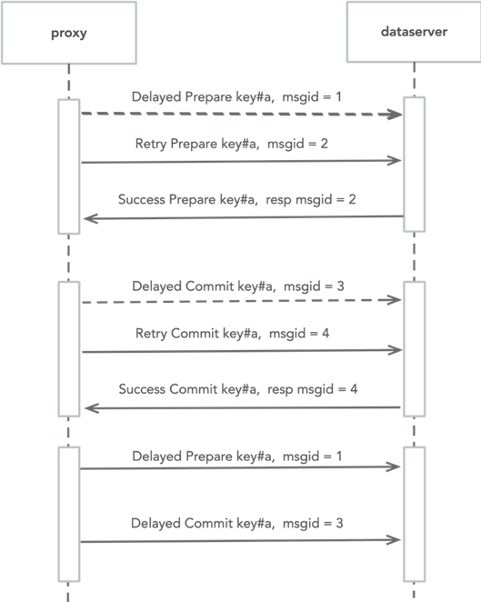

# 事务设计

## 1 整体思路

### 1.1	减少同步次数

最终实现二次同步加若干次异步操作：
1. 并发prepare所有事务参与者的数据；
2. 更新事务元数据设置状态为COMMITTED，成功后给客户端返回；
3. 异步commit所有参与者数据和清除事务元数据

### 1.2	完善读已提交语义

dataserver在处理select和下推请求时，读到intent时由dataserver判断事务状态，
不向proxy返回intent记录。

### 1.3	Recovery流程转移

由dataserver负责事务的recovery逻辑，proxy除prepare阶段不接触intent数据。

### 1.4	其他需求支持

交互式事务支持
1. 本事务内intent可见；
2. 同一事务同一key支持多次prepare，以最后一次为准

## 2 事务流程

### 2.1 事务元数据

事务状态等元数据从原primary key的prepare数据中抽离，单独存储。

事务元数据包含：
1. 事务状态（用于原子地commit或abort事务）
2. 事务参与者所有的keys（用于recovery）
3. 其他元数据（如ttl等）

事务元数据的存储方式也为key-value形式，存放于一个新的Column Family中。
 
meta key的选择仍然按照原来的逻辑，从participant keys中选择一个作为meta key；以分散事务元数据的读写，避免热点问题。

所有的元数据整体上形成一个逻辑上的事务记录表。

<br />



### 2.2 写入流程	

#### 2.2.1 第一阶段 Prepare：

从事务的participant keys中选择一个key作为meta key用于存储事务元数据；

按照range切分所有的participant keys组织prepare请求，并行发送；

* 核心数据结构和接口：

```
enum OpType {
    INSERT  = 0;
    DELETE  = 1;
}

message TxnIntent {
    OpType typ          = 1;
    bytes key           = 2; // encoding pk or index key
    bytes value         = 3; // Encoded column values (all non-primary key columns) or index value
    bool  check_unique  = 4; // for unique index or insert check pk duplicate
    uint64 expected_ver = 5; // if 0 means do not check version
    uint64 op_seq       = 6; // distinguish the order of multi op with the same key
}

message PrepareRequest {
    string txn_id                        = 1;
    bool local                           = 2;  // local txn, all 
    bytes meta_key                       = 3;
    uint64 lock_ttl                      = 4;  // unit: milliseconds
    repeated TxnIntent intents           = 5;
}

message PrepareResponse {
    repeated TxnError errors  = 1;
}
``` 

<br />



<br />

Prepare请求结合了加锁和预写（intent）两个逻辑。

Prepare阶段发现写冲突：<br/>
即prepare请求的返回中如果发现有key已经被锁住的错误，则在当前事务超时时间内带backoff不断重试prepare请求，等待其他事务完成后解锁或者冲突事务的锁过期由dataserver recovery清理后，而后可以加锁prepare成功。

#### 2.2.2 第二阶段 Decide:
根据第一阶段prepare的结果，决策当前事务的终止状态：commit或abort

如果是commit状态写事务元数据（发送SetTxnMeta请求），成功后给客户端返回成功；

后台异步commit或abort所有的participant keys（发送Decide请求）；

所有key都decide完成后，后台异步删除事务元数据；

* 核心数据结构和接口：

```
message SetTxnMetaRequest {
    string meta_key = 1;
    string txn_id = 2;
    TxnStatus status = 3;
    repeated bytes participant_keys = 4; // if status is committed, participant_keys is required
}

message SetTxnMetaResponse {
    TxnError err = 1;
}

// Commit or Rollback
message DecideRequest {
    string txn_id       = 1;
    TxnStatus status    = 2;
    repeated bytes keys = 3;
}

message DecideResponse {
    TxnError err                  = 1;
}
```

<br />


<br />

一阶段写入优化：
* 对于单分片事务（即所有participant keys都位于同一个分片内），
只发送一阶段的prepare请求（带有local特殊标记），不需要第二阶段。
* 限制：不支持交互式事务

### 2.3 Select

Proxy不需要任何特殊处理，DataServer返回的都是已提交的数据。

DataServer在处理Select请求时，同时搜索txn（预先数据）和default（已提交）两个空间内的数据，决策使用新旧哪个数据；
 
图：每个key的查询处理流程：

<br />



<br />
 
### 2.4 Update和Delete

先在proxy端查询符合条件的rows，再执行两阶段写入，prepare请求中设置expected version，dataserver处理prepare请求时需要校验一次version，如果prepare返回version不一致，需要abort当前事务，重启一个新的事务（重新查询）。

### 2.5 异常处理和恢复

#### Recover时机：

访问（处理prepare和查询请求时）某个key发现上面有锁且超时；

#### Recover流程：

当访问某行发现有lock超时时，需要去尝试清理该lock，清理即尝试abort该行所属事务，对其进行回滚操作，具体流程如下：

发送status=aborted的SetTxnMeta请求：
1. 如果Abort该事务成功，会返回该事务所有参与者的keys，执行roll-back回滚这些key；该阶段写入的meta元数据需要保持一段时间，阻止proxy恢复后的commit尝试，元数据的删除依靠dataserver后台的gc扫描线程；
2. 如果Abort该事务失败，并且返回事务状态是已提交，执行roll-forward，提交所有keys，如果全部成功删除事务元数据；

<br />


<br />
 
TODO: 为了避免多个实例同时对一个事务进行recover，后期可以在元数据里记录事务状态最后更新时间，如果更新时间不超过一定时长，不允许操作。

## 3 Failover和分裂

txn intent和 txn meta数据都跟随其对应的主key进行分裂和迁移。

## 4 DataServer端详细处理逻辑

dataserver端在处理prepare和decide请求时，先检查请求中的所有key是否都在本range内，如果不在则直接返回StaleEpoch或者KeyNotInRange错误，不进行下一步处理

### 4.1 处理PrepareRequest

对于请求中的每个intent依次检查是否可以加锁成功，可以加锁的条件：
1. 当前intent对应的key在txn空间内不存在lock记录；
2. 存在但事务ID相同；

无法加锁成功的key通过repsonse里的errors里返回，有锁超时的进入recovery流程。

可以加锁后校验version和check_unique信息，如果检验不通过，整个prepare请求失败；

加锁和校验都通过后，批量写入intents，写入intent时获取本地时间加上TTL生成绝对过期时间；

如果为local事务，所有key都没问题再直接写入data空间（已提交空间），否则返回prepare错误。

### 4.2 处理SetTxnMetaRequest

检查请求中的事务状态是否跟当前记录有冲突，比如当前事务状态已被更新为COMMITTED或者ABORTED，则不允许再被更新为不一致的状态，返回事务当前状态；

### 4.3 处理DecideRequest

针对请求中的每个key校验是否存在对应txn_id的intent，不存在则忽略；

存在进入下一步处理：
1. 如果请求中状态为COMMITTED，把intent写入data空间（已提交空间）并删除intent；
2. 如果请求中状态为ABORTED，删除intent；

### 4.4 处理ClearTxnMetaRequest

存在对应txn_id 和 meta_key的事务记录则删除；

不存在也返回成功；

## 5 当前实现限制

prepare请求状态未确定如网络超时不可重试prepare；<br/>
如果需要重试可以类似版本冲突错误重启一个新的事务；

异常流程：事务的部分key的修改被重放（中间可能有其他事务对该key有修改）

<br />



<br />

## 6 下一步优化

死锁的检测和排查


## 7 Dataserver待实现的功能点

* 分裂和快照对txn meta数据的处理
* 状态为abort的过时的meta数据扫描和清理
* 访问其他ds的sdk（向master查询路由，请求其他ds）
* 处理select请求的读流程（事务状态查询）
* 处理prepare、decide等事务写入流程
* 事务recovery流程
* 处理请求时遇到阻塞事件后（如select时需要查询事务状态）的调度模型设计
