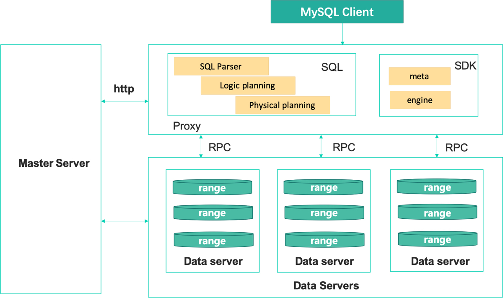

简介
=============

ChubaoDB是云原生、以内存为中心的分布式数据库，基于google spanner 自研，支持Redis协议和MySQL协议。可理解为 JIMDB/redis + Vitess/MySQL

特性
=============

高性能
------------------------

* 以内存为中心的分布式数据库

* 出色的读性能 + 良好的写性能

低成本
------------------------

* 内存 + 硬盘 双存储方式

* 智能调度

高可用，强一致，可扩展，高可靠
------------------------------------------

* raft复制协议

* 自动扩容，自动均衡

* 故障自动恢复

云原生
------------

* Kubernetes编排

易于迁移
------------------------

* 迁移工具

* 支持redis/mysql，几乎不需要修改代码

便于管理
------------------------

* 管理系统

* 报警系统

* 丰富的监控报表支持

Architecture
===============

